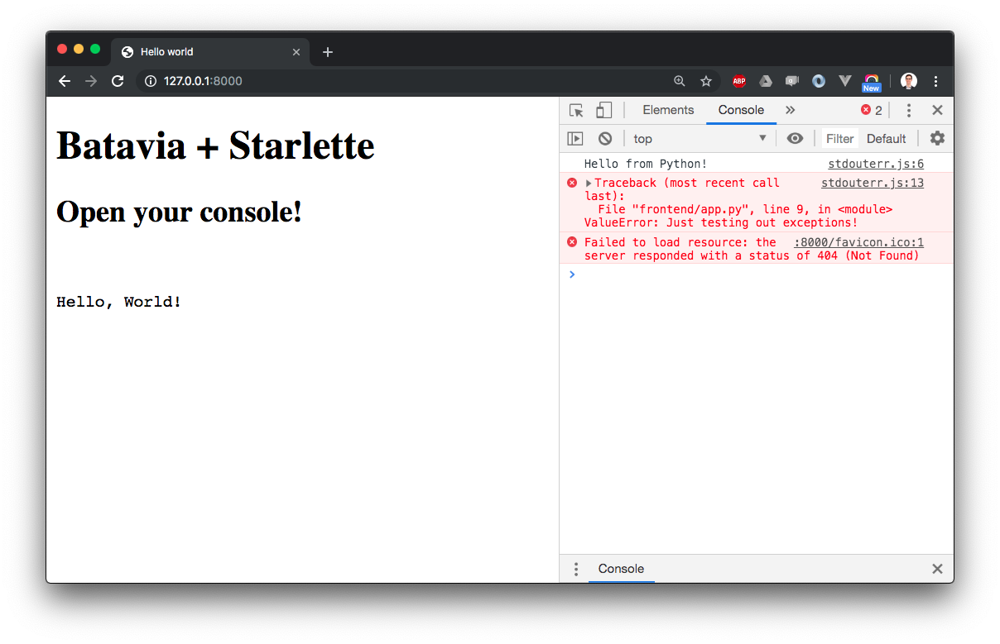

# batavia-starlette

Run Python in the browser using [Batavia] and [Starlette].

[batavia]: https://github.com/beeware/batavia
[starlette]: https://www.starlette.io



## Installation

First, install Batavia. The full instructions are [here](https://batavia.readthedocs.io/en/latest/tutorial/tutorial-0.html), but we provide a convenience script that should work on Linux/macOS:

```bash
chmod +x scripts/install_batavia
./scripts/install_batavia
```

Then install Python dependencies:

```bash
python -m venv venv
. venv/bin/activate
pip install -r requirements.txt
```

You're good to go!

## Quickstart

Start the web server:

```bash
uvicorn server:app
```

Go to http://127.0.0.1:8000, and the following will happen:

- An HTML page is shown. It was server-rendered via Jinja2 by the Starlette web app.
- The HTML page contains a script that contains the _Python bytecode_ for `frontend/app.py`.
- The Batavia JS virtual machine is loaded and _runs that bytecode_.
- As a result, `frontend/app.py` ends up _running in your browser_, and doing stuff such as printing to the browser console and manipulating the DOM.

✨🌟✨
